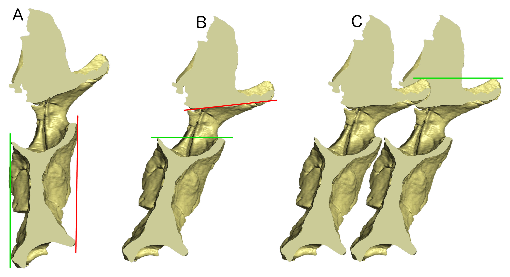
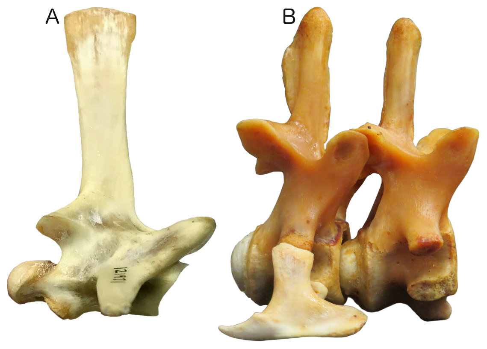
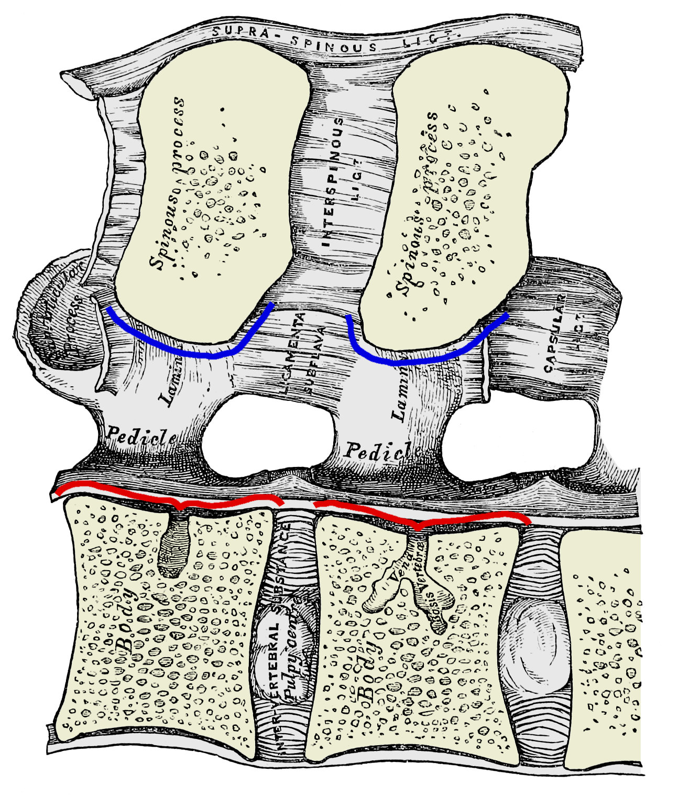

# What do we mean by the directions “cranial” and “caudal” on a vertebra?

Mike Taylor.
Department of Earth Sciences, University of Bristol, Bristol BS8 1RJ, UK.
<dino@miketaylor.org.uk>

Mathew J. Wedel.
College of Osteopathic Medicine of the Pacific and College of Podiatric Medicine, Western University of Health Sciences, Pomona, California, USA.
<mathew.wedel@gmail.com>

## Contents

<!-- md2toc -l 2 -s 1 vo-manuscript.md -->
* [Introduction](#introduction)
    * [Anatomical nomenclature](#anatomical-nomenclature)
    * [Institutional abbreviations](#institutional-abbreviations)
* [Four definitions of “horizontal”](#four-definitions-of-horizontal)
    * [1. Long axis of centrum is horizontal](#1-long-axis-of-centrum-is-horizontal)
    * [2. Articular facets of centrum are vertical](#2-articular-facets-of-centrum-are-vertical)
    * [3. Neural canal is horizontal](#3-neural-canal-is-horizontal)
    * [4. Similarity in articulation](#4-similarity-in-articulation)
* [Comparison of definitions](#comparison-of-definitions)
* [Conclusion](#conclusion)
* [Discussion](#discussion)
    * [Relevance to other work](#relevance-to-other-work)
    * [Open peer review](#open-peer-review)
    * [Open composition](#open-composition)
* [Acknowledgements](#acknowledgements)
* [References](#references)

## Introduction

In late 2017, one of us submitted a paper (Taylor 2018b) redescribing the sauropod dinosaur _Xenoposeidon_ and assigning it to the group Rebbachisauridae, based on the holotype and only specimen NHMUK PV R2095. Among the five diagnostic characters given for _Xenoposeidon_ was #2, “Neural arch slopes anteriorly 30°–35° relative to the vertical” (Taylor 2018b:5). In a helpful and detailed peer review, Phil Mannion (2018a) commented:

> The strong anterior slant of the neural arch appears to be dependent on how you've chosen to orientate the vertebra, but there doesn't appear to be any need to orientate it in this way.

I (Taylor) carelessly failed to directly address this criticism in my response letter, although I did add a brief discussion of the orientation. Consequently Mannion raised the matter again in the second round of review (Mannion 2018b):

> I'm still unconvinced by the proposed anterior slant of the vertebra and don't think that there's any evidence for orientating it in this way. I went into the NHM to re-look at this. No aspect of the posterior articular surface of the centrum leads me to orient the vertebra in the same way of shown in your figures. In addition, as currently orientated, the floor of the neural canal is strongly tilted - it seems more conservative to assume that this is horizontal. Similarly, by following that orientation, this would then make the long-axis of the lateral pneumatic opening closer to horizontal. By orientating the vertebra this way, the anterior margin is sub-vertical, with a very gentle anterior deflection (i.e. fairly normal for a sauropod), and the M-lamina is much closer in orientation to that of _Rebbachisaurus_.

I responded (Taylor 2018a):

> Phil remains convinced that the proper orientation of the vertebra gives is a lesser forward slope that as described in the manuscript. Having once more revisited my photos and 3D models, I remain convinced that the present orientation is essentially correct. It could be out by five degrees or so, so I have changed “35 degrees” to “30-35 degrees” throughout.

Mannion was gracious enough to accept this, and the paper proceeded to publication with the relevant section (Taylor 2018b:5) essentially unchanged. But the question he had raised continued to occupy me: what exactly _is_ the “correct” orientation of the vertebra, relative to which we can measure the angle of the sloping neural arch? And what do we even mean by “correct”? Figure A shows the difference between the slope as published (part A), and as interpreted by Mannion (part B).

---

> **Figure A.** NHMUK PV R2095, the holotype dorsal vertebra of _Xenoposiedon proneneukos_ in left lateral view.
> **A.** In the canonical orientation that has been used in illustrations in published papers (Taylor and Naish 2007, Taylor 2018b), in blog-posts and even on mugs (Taylor 2017).
> **B.** Rotated 15° “backwards” (i.e. clockwise, with the dorsal portion displaced caudally), yielding a sub-vertical cranial margin in accordance the recommendation of Mannion (2018b).
> In both parts, the blue line indicates the horizontal axis, the green line indicates the vertical axis, and the red line indicates the slope of the neural arch as in Taylor (2018b: figure 3B, part 2).
> In part A, the slope (i.e. the angle between the red and green lines) is 35°; in part B, it is 20°.

---

The neural arch slopes relative to the vertical. Vertical is defined as being orthogonal to the horizontal. That in turn is defined by the cranial-caudal (= anterior-posterior) axis. But what do those directions mean? How can we define them for a given vertebra?

In the present paper, we aim to answer that question. We will propose and discuss four candidate criteria, recommend the one we consider most practical and informative, and determine the slope of _Xenoposeidon_'s neural arch more precisely. In the absence of such criteria, it is perhaps inevitable that we will continue to see inconsistency such as that in Saegusa and Ikeda's (2014: figure 8) illustration of the caudal vertebrae of _Tambatitanis amicitiae_ (reproduced here as Figure C).

---

> **Figure C.** _Tambatitanis amicitiae_ holotype MNHAH D-1029280, caudal vertebrae in right lateral view. Top row, caudals 1–11; bottom row, a set of more caudal caudals, not necessarily contiguous, designated x1–x11. Note the more cranial caudals are oriented such that their articular surfaces are vertical, even when this means that the long axis of the vertebra is steeply inclined as in caudals 4, 5, 7 and especially 8; while the more posterior caudals are oriented such that their long axis is horizontal, even when this means that the articular surfaces are inclined as in caudals x6 and x7, which slope in opposite directions.
> Reproduced from Saegusa and Ikeda (2014: figure 8) under the CC By 3.0 licence.

---

Note that the present question is nothing to do with life posture, which is a much more difficult problem, subject to many more degrees of uncertainty. Animals do not hold their vertebral columns any anything close to true horizontal — not even though that we characterise as having horizontal posture — and we do not want to tie the meaning of our very nomenclature to something so variable and unpredictable. Otherwise we would have to define “horizontal” for the mid-cervical vertebrae of parrots as upside-down (Figure B).

---

> **Figure B.** Parrot skeleton with hemisected integument (probably _Amazona ochrocephala_) in left lateral view, in the Natuurhistorisch Museum of Rotterdam. Photograph by Marc Vincent, used with permission. Note the very strong 'S'-curve of the neck, such that the most caudal cervical vertebrae are inclined downwards, then more cranial vertebrae are, progressively, inclined upwards, near vertical, sloping _backwards_, then vertical again, and finally sloping upwards to the skull.

---

Instead, we seek abstract notions of "horizontal", "cranial" and "caudal" that apply irrespective of the specific posture adopted by an animal — something that is especially important for the study of extinct animals for which habitual posture cannot be known with certainty and remains controversial (e.g. sauropod neck posture: Steven and Parrish 1999 vs. Taylor et al. 2009). Our goal is to have an objective standard by which to assess properties such as the slope of a neural arch.

### Anatomical nomenclature

As dinosaur palaeontologists, we generally use and prefer the Owenian system of anatomical directions, with anterior and posterior indicating the forward and backward directions accordingly (Owen 1854) — hence the use of these terms in the _Xenoposeidon_ paper, its reviews, and the associated discussion. However, for the present paper, we seek directional definitions that are unambiguous for all vertebrates: not only those like dinosaurs, dogs and fish, which hold their vertebral columns essentially horizontal; but also those like humans, penguins and meerkats, which hold their vertebral columns essentially vertical. For this reason, avoiding ambiguity in humans, where “anterior” means ventral (towards the belly) rather than cranial (towards the head), we will use terms cranial and caudal, and derived terms such as craniodorsal.

### Institutional abbreviations

* **CM** — Carnegie Museum of Natural History, Pittsburg, Pennsylvania, USA.
* **FMNH** — Field Museum of Natural History, Chicago, Illinois, USA.
* **LACM** — Natural History Museum of Los Angeles County, Los Angeles, California, USA.
* **MB.R** — Museum für Naturkunde Berlin, Berlin, Germany; fossil reptile collection.
* **MWC** — Museum of Western Colorado, Fruita, Colorado.
* **MNHAH** — Museum of Nature and Human Activities, Hyogo, Japan.
* **NHMUK PV** — Natural History Museum, London, UK; vertebrate palaeontology collection.
* **WRAZL** — The William R. Adams Zooarchaeology Laboratory, Indiana University Bloomington, Indiana, USA.

## Four definitions of “horizontal”

We have conceived four candidate definitions of what it might mean for a vertebra to be horizontal — and therefore what the directions cranial and caudal (and dorsal and ventral) might mean. We will now consider them in turn.

### 1. Long axis of centrum is horizontal

The default approach for most illustrations, especially for elongate vertebrae such as sauropod cervicals, has been to orient them more or less by eye. In practice, this means to draw a line between the cranial and caudal articular surfaces of the centrum at half height, and orient that line horizontally (Figure D).

---

> **Figure D.** _Giraffatitan brancai_ lectotype MB.R.2180 (formerly HMN SI), fifth cervical vertebra in right lateral view, oriented horizontally according to the long axis of the vertebra (red line). The long axis may be defined as the line between the vertical midpoints of the cranial and caudal articular surfaces — but the height of those midpoints depend on the selection of dorsal and ventral extremities of those surfaces, and these are not always obvious. The blue lines at each end of the vertebra show candidate margins. In both cases, the dorsal margin is more or less uncontroversial; but there are several candidates for the ventral margin, especially for the caudal articular surface, which are impossible to resolve using only lateral-view photos and potentially even with the complete fossil to hand.

---

However, this approach cannot be meaningfully used for craniocaudally short vertebrae such as most caudals, in which there is no long axis (Figure E.A).

And even for elongate vertebrae, this immediately intuitive approach breaks down when considered in detail. A line between the cranial and caudal articular surfaces at half height sounds simple, but to determine half-height we need to establish the dorsal and ventral margins of the articular surfaces, and this is not always clear, especially for fossil vertebrae. In Figure D, the upper blue lines at each end of the vertebra mark to dorsalmost extent of the two articular surfaces, and are not difficult to determine. But the ventralmost extent of both surfaces is much more ambiguous. Candidate ventral extents are shown by the other blue lines. Cranially (to the right), the ventralmost line is aligned with the ventralmost point on the cranial part of the vertebra, but it is not certain that this is part of the articular condyle rather than some other process; the two lines immediately above show two other points on the curvature of the condyle that could be interpreted as its ventralmost extent. Only with the benefit of a caudal view does it become apparent that the upper two lines mark breakages in the cotyle rim rather than a legitimate ventral margin, and that even the lowest line represents a point of breakage rather than for example, a separate ventrolateral process. In fact, the true ventral extent of this articular surface would have been located some way below the preserved portion of the bone — as is shown in Janensch's (1950: figures 23, 25) reconstruction of this vertebra.

All this shows that relying on the eye to determine horizontal orientation can be very misleading, and that a more objective approach is needed. We will now consider three such methods (Figure E).

---

> **Figure E.** _Haplocanthosaurus_ ?_priscus_ MWC 8028, caudal vertebra ?3, in cross section, showing medial aspect of left side, in three orientations.
> **A.** In "articular facets vertical" orientation (method 2 of this paper). The red line joins the dorsal and ventral margins of the caudal articular facet, and is oriented vertically; the green line joins the dorsal and ventral margins of the cranial articular facet, and is nearly but not exactly vertical, instead inclining slightly forwards.
> **B.** In "neural canal horizontal" orientation (method 3 of this paper). The red line joins the cranial and caudal margins of the roof of he neural canal, and is oriented horizontally; the green line joins the cranial and caudal margins of the floor of the neural canal, and is close to horizontally but inclined strongly downwards.
> **C.** In "similarity in articulation" orientation (method 4 of this paper). Two copies of the same vertebra, held in the same orientation, are articulated optimally, then the group is rotated until the two are level. The red line connects the cranial part of the base of the neural canal of the two copies, and is horizontal; but a horizontal line could join the two copies of any point.
---

### 2. Articular facets of centrum are vertical

In this approach, we define horizontal as that orientation in which the cranial and caudal articular facets of the centrum are vertical. (Figure E.A). This is appealing when dealing with short, tall vertebrae, but less so for long, slender vertebrae such as the _Giraffatitan_ cervival of Figure D.

For the Haplocanthosaurus cadal shown here, the method gives a nearly unambiguous result as the cranial and caudal articular facets are very nearly parallel: in Figure E.A, where the red line showing the orientation of the caudal facet is horizontal, the green line showing the orientation of the cranial facet is cranially inclined by less than one degree. However, its meaning is ambiguous for “keystoned” vertebrae in which the cranial and caudal facets are not parallel, as for example the giraffe C7 shown in Figure F.

---

> **Figure F.** Giraffe _Giraffa camelopardarlis_ FMNH 34426, two copies of cervical 7 in left lateral view, articulated, both horizontal according to the "similarity in articulation" orientation (method 4 of this paper).
> The 7th cervical vertebra of the giraffe is strongly "keystoned", with the centrum (excluding the articular condyle) forming a parallelogram whose dorsal length is less than its ventral length.
> The red lines indicate the orientation of the cranial articular surfaces, following the lines of ligament attachment immediately behind the articular condyle; the green line indicates the orientation of the margin of the caudal articular surface.
> The angle between the red and green lines is about 19 degrees, meaning that if the two copies of the vertebra were oriented such that the cranial and caudal articular surfaces were optimally articulated, there would be a 19 degree angle between the vertebrae.
---

Strongly opisthocoelous vertebrae such as giraffe cervicals, and strongly procoelous vertebra such as monitor lizard caudals (Figure G.A) and crocodilian cervicals (Figure G.B) exemplify another difficulty of this method: how does one even determine the orientation of an articular surface that is not flat? For concave surfaces such as the caudal articulation of the giraffe cervical and the cranial articulations of the crocodile cervicals and monitor caudals, the best solution is probably to project a straight line between the caudalmost extremities of the dorsal and ventral surfaces, as shown by the green line in Figure F. However, these points are not always easy to determine: in the _Xenoposeidon_ dorsal vertebra, the caudal margin of the neural arch appears in lateral view to blend into that of the centrum, so that there is no obvious point that is the caudalmost extremity of the dorsal surface of the centrum; and in the _Giraffatitan_ cervical vertebra (Figure D), parts of the caudoventral margin of the vertebra are broken off, so it is not possible to determine the caudalmost extremity of the ventral surface. Convex surfaces such as the cranial articulation of the giraffe cervical and the caudal articulations of the crocodile cervicals and monitor caudals present an even more difficult problem: what can be defined to be the orientation of a surface that is curved in lateral view? For some vertebrae, there is a clear ridge projecting outward from the concave articular extremity, and the orientation of that ridge can be used, as shown by the red lines in Figure F. But this is not present in all opisthocoelous and procoelous vertebrae: and even when it is, the ridge is often somewhat ill-defined, so that superimposing an orientation line is more an art than a science.

---

> **Figure G.** Proceoelous vertebrae for which it is difficult to determine the orientation of the articular surfaces, scaled to the same vertebral height.
> **A.** Komodo dragon _Varanus komodoensis_, LACM Herpetology specimen 121971, cranial caudal vertebra in right lateral view. Note the extremely convex and strongly inclined caudal articular surface to the left; the cranial articular surface to the right is correspondingly convex and inclined.
> **B.** _Alligator mississippiensis_ WRAZL 9840044, seventh cervical vertebra (with cervical rib attached) and sixth cervical vertebra (without rib) in articulation, in right lateral view. Photograph kindly provided by Jess Miller-Camp. While the caudal articular surfaces are strongly convex, their orientation of each can be interpreted as that of the well-defined "collar" that surrounds it.

---

Finally, the giraffe C7 also illustrates yet another difficulty with this definition of horizontality: if the vertebra were oriented such that either the cranial (red line) or caudal (green line) articular surface were vertical, the resulting orientation, with a very obvious diagonal slope to the long axis of the vertebra, would immediately strike us as "wrong". That in itself is not a fatal strike against the method, but its violation of what strikes us intuitively as correct must weigh against it.

### 3. Neural canal is horizontal

An alternative to this method is to fix the orientation of the neural canal as "horizontal", as shown in Figure E.B. For a given verteba, this can yield _extremely_ different results from method 2, as seen in the contrast between the two orientations shown of the _Haplocanthosaurus_ caudal in parts A and B of Figure E. It can also be seen that the giraffe C7 in figure F and the Komodo dragon caudal in Figure G.A, both which are here depicted with the neural canal close to horizontal, would be oriented very differently according to method 2.

However, this method, too, is subject to some ambiguity.

First, just as Method 2 can yield a different orientation depending on whether the orientation of the cranial or caudal articular surface is used, so the present method can yield a different orientation depending on whether the orientation of roof or the floor of the neural canal is used: compare the red and green lines approximating the roof and floor of the _Haplocanthosaurus_ caudal in Figure E.B. For a tubular neural canal of constant diameter, this problem does not arise, but not all neural canals are this regular, and
"trumpet-shaped" canals can yield widely divergent orientations of roof and
floor.

Secondly, as again shown by the _Haplocanthosaurus_ caudal of Figure E, the individual margins of the neural canal may not be straight. This is particularly apparent for the floor of the canal, which is deeply dished. However, it is easy in this case to define the orientation of the neural canal floor as that of a straight line joining its cranialmost and caudalmost extent. A less obvious but more profound difficulty is presented by the roof of this vertebra's neural canal, in which it is not apparent where the cranialmost point is: two equally credible alternatives, points _a_ and _b_, yield "horizontal" lines whose inclinations differ by 3.8 degrees.

---

> **Figure H.** _Haplocanthosaurus_ ?_priscus_ MWC 8028, caudal vertebra ?3, in cross section, showing the ambiguous interpretation of the roof of the neural canal.
> **A.** The vertebra oriented as in Figure E.B. The vertical blue line indicates the position identified as the cranialmost extent of the roof of the neural canal (point _a_), and the red line shows the interpretation of "horizontal" based on that location.
> **B.** The same vertebra, but with a different choice of cranialmost extent of the roof of the neural canal (point _b_), again marked with a vertical blue line. When a line is projected from here to the same caudalmost extent as in part A, the resulting notion of "horizontal" differs by 3.8 degrees.

---

Even worse, when one or both of the margins of the neural canal is convex in cross-secton, there is no cranialmost or caudalmost margin, and therefore no straight line to project between them (Figure I).

---

> **Figure I.** Right halves of two vertebrae from the lumbar (caudal dorsal) region of a human _Homo sapiens_ in sagittal cross-section (cranial to left). Modified from Gray 1858: figure 99. Pale yellow indicates bone in cross-section, grey indicates both bone further from the midline and soft tissue. The red lines mark the floor of the neural canal: since the cranial and caudal ends of the floor of the canal are slightly elevated dorsally relative to the middle part of the canal, it is easy to project a line between these eminences and designate this as the trajectory of the canal. The blue lines mark the roof of the neural canal, but this is convex throughout its length for each vertebra. THere is therefore no way to designate any single tangent to it as the trajectory of the neural canal roof of the vertebra as a whole.

---

A further difficulty with this method is that, unlike the articular surfaces, the neural canals of vertebrae can be difficult to examine and measure. In fossil vertebrae, they are frequently not prepared out of matrix. But even when a complete and completely prepared vertebra is available, a physical or virtual sagittal hemisection is required to fully depict and determine the neural canal trajectory, and this is only rarely available.

### 4. Similarity in articulation

Definition method 1 is based on the centrum of the vertebra; method 2 is based on the cranial and caudal articular facets; and method 3 is based on the neural canal. But is it possible to arrive at a definition that takes the whole vertebra into account?

---

> **Figure K.** The steps of the similarity-in-articulation method of determining horizontal orientation of a vertebra, illustrated using _Haplocanthosaurus_ ?_priscus_ MWC 8028, caudal vertebra ?3.
> **A.** Two identical copies of the same vertebra depicted in the same orientation.
> **B.** The two copies brought into optimal whole-vertebra articulation without rotating either.
> **C.** The articulated pair rotated into that orientation in which they are at the same height. This is orientation is designated as horizontal according to the present method.

---

The method that we call "similarity in articulation" does this. It consists of four steps as follows:

1. Depict the vertebra in any orientation. (It doesn't matter which orientation is chosen at this stage, as it will be changed in step 4.)
2. Add another copy of the same vertebra in the same orientation (Figure K.A).
3. without rotating either copy, move them into the relative position that gives the best articulation, based on both the centrum articulations and the zygapophyses (Figure K.B.)
4. Rotate the articulated grouping of both copies into the orientation where they are at same height (Figure K.C). The resulting orientation is deemed to be horizontal according to this method.

Note that this method does not require two vertebrae: it uses two _copies_ of the _same_ vertebra to determine the orientation of that vertebra in isolation.

Figure F shows the method applied to a giraffe _Giraffa camelopardarlis_ FMNH 34426, cervical 7. Note that the intercentral joint shows a strong divergence between the planes of the two articular surfaces: a "better" articulation might be achieved between the two copies of the vertebra is one were allowed to rotate relative to the other, but that would not yield a single orientation and so would violate the mechanism of method 4.

This definition of "horizontal" is less intuitive than definitions 1–3, but has some advantages. First, it can be determined for any more or less complete vertebra, irrespective of whether or not the articular faces are parallel or the neural canal is tubular. Second we may hope that, since it uses the whole shape of the vertebra, this method is less vulnerable to yielding a distorted 
result when the vertebra is damaged. Third, it constrains subjectivity to a single well-defined judgement which can be reviewed and revised as needed: that of how the two similarly-oriented copies of the vertebra best articulate together.

## Comparison of definitions

XXX Definition 2 of horizontality can make the neural canal jagged. This never happens in life: it can curve but never kink. XXX use slides 31 & 32.

XXX Compare sequence-of-hap illustration with hemisected horse.

XXX Definition 3 is anatomically informative, reflecting the developmental sequence.  The vertebrae form around the spinal cord. Matt to write this bit.

XXX Seek permission to use Liem et al. (2001): fig 8.3, or redraw it.

XXX This orientation is used for _Opisthocoelicaudia skarzynskyii_ caudals 6–8 in Borsuk-Bialynicka (1977: plate 5: figure 2a), but this is because the vertebrae were preserved in articulation in this orientation, suggesting this reflects relative orientation in life.

XXX Definition 4 can't be done at all for _Xenoposeidon_, which is where we came in.

XXX When we floated these notions on SV-POW!, all the methods had adherents. No one method can satisfy all desiderata.

## Conclusion

At minimum, we advocate that each paper should explicitly adopt a definition of “horizontal”, and use it consistently.

We _tentatively_ recommend the base-of-the-neural-canal-is-horizontal method.

XXX say more

Orientation by this method can often by approximated using low-tech means such as a roll of paper pushed through the neural canal (Figure J), yielding "good enough" results. XXX say more. As the rolled-up paper naturally uncoils, it fills as much of the space of the neural canal as possible, giving a good sense of the trajectory of the roof and floor of the canal.

---

> **Figure J.** A selection of vertebrae with the approximate trajectory of their neural canals determined by the simple method of pushing a rolled-up piece of paper through their neural canals.
> **A.** _Brachiosaurus altithorax_ holotype FMNH P 25107, first and partial second caudal vertebrae in right lateral view.
> **B.** _Camarasaurus_ sp. CM 584, anterior caudal vertebra ?4 in right lateral view.
> **C.** _Camarasaurus_ sp. CM 584, mid-caudal vertebra ?12 in left lateral view.
> **D.** Juvenile giraffe _Giraffa camelopardalis_ from MPT's collection, cervical vertebra 6 in left lateral view.
> **E.** Juvenile giraffe _Giraffa camelopardalis_ from MPT's collection, cervical vertebra 7 in left lateral view. Note the much stronger inclination than in C6.
> **F.** Ostrich _Struthio camelus_ from MPT's collection, cervical vertebra 16 in left lateral view.

---

## Discussion

### Relevance to other work

There are biological questions for which we cannot give a well-defined answer except in the context of a well-defined vertebral orientation: e.g., measuring cross-sectional area of the neural canal. XXX use slide 17.

XXX Cite work on this

XXX Use Hap caudal illustration

### Open peer review

In publishing the _Xenoposeidon_ revision (Taylor 2018b) in the journal _PeerJ_, I (Taylor) was pleased to take advantage of the journal's policy of allowing submitted drafts, peer-reviews, response letters and handling editors' comments to be published alongside the final paper. It is because these materials are published (### Young et al. 2018) that the sequence of discussion is preserved, and Mannion's helpful and gracious comments are available to be read — not only as the extracts in the present paper, but in their full context.

We endorse the publication of peer reviews, and both take this option whenever it is offered. Aside from their value as part of the scholarly record, published peer-reviews are visible evidence of the reviewers’ broader contribution to science, and can be taken into account in evaluating researchers for jobs, promotions, tenure and grants. Sets of reviews, accompanied by the corresponding versions of the manuscript, can be an important pedagogical tool for teaching students in practical terms how peer-review works: for example, Andy Farke (Raymond M. Alf Museum) writes “I use those published reviews when we are talking about the process of scientific publication. I have the students read the reviews and read the responses, and then talk about how the paper changed as a result” (pers. comm. 2018). Crucially, reviews can play an important role in the origination of new research questions, and should be acknowledged: the present work on defining vertebral orientation arises directly from Phil Mannion's peer-review comments (Mannion 2018a, 2018b).

### Open composition

This work first began to take shape as a series of blog-posts (Taylor 2018c, Taylor 2018d, Wedel 2018a, Wedel 2018b, Wedel 2018c) which were drawn together in a talk (Taylor and Wedel 2018) presented by Taylor as part of the 1st Palaeontological Virtual Congress (http://palaeovc.uv.es/) and announced online (Wedel 2018d). This manuscript was developed in the open, in a public GitHub repository (https://github.com/MikeTaylor/palaeo-vo; see Taylor 2018e). We commend this approach as valuable for soliciting informal feedback early in the process, and in making the research itself available quickly.

## Acknowledgements

XXX John Hutchinson for giraffe

XXX Matt Cobley for ostrich

First, we thank Phil Mannion (Imperial College London) both for his multiple rounds of review of the _Xenoposeidon_ manuscript and for giving us permission to quote relevant excepts in the current paper. We also thank Marc Vincent for permission to reproduce his photograph in Figure B, Jess Miller-Camp for responding to a cry for help on Twitter and providing the alligator cervical photograph in Figure G, and Andy Farke for permission to cite a personal communication.

We are deeply grateful to the curators and collection managers for access to specimens used in this study, including
* Daniela Schwarz (Museum für Naturukunde Berlin) for _Giraffatitan_.
* Julia McHugh (Dinosaur Journey) for _Haplocanthosaurus_.
* Bill Simpson (Field Museum of Natural History, Chicago, IL) for _Brachiosaurus_ and the giraffe.
* Neftali Camacho (Los Angeles County Museum of Natural History) for the Komodo dragon.
* Sandra Chapman (Natural History Museum, London, UK) for _Xenoposeidon_.
* Ken Noriega (Western University of Health Sciences) for the horse head.

Finally, we thank John Yasmer and Thierra Nalley (Western University of Health Sciences) for their assistance in CT scanning and 3D modelling the _Haplocanthosaurus_ caudal vertebra.

## References

* Gray, Henry. 1858. _Anatomy: descriptive and surgical_, 1st edition. J.W. Parker, London, UK.
* Janensch, Werner. 1950. Die Wirbelsaule von _Brachiosaurus brancai_. _Palaeontographica_ (Suppl. 7) 3:27-93.
* Krings, Markus, John A. Nyakatura, Matin S. Fischer and Hermann Wagner. 2014. The cervical spine of the American barn owl (_Tyto furcata pratincola_): I. Anatomy of the vertebrae and regionalization in their S-shaped arrangement. _PLOS ONE_ **9(3)**:e91653. https://doi.org/10.1371/journal.pone.0091653
* Mannion, Philip D. 2018a. Peer Review #3 (1st round) of "_Xenoposeidon_ is the earliest known rebbachisaurid sauropod dinosaur (v0.1)". PeerJ. doi:10.7287/peerj.5212v0.1/reviews/3
* Mannion, Philip D. 2018b. Peer Review #3 (2nd round) of "_Xenoposeidon_ is the earliest known rebbachisaurid sauropod dinosaur (v0.2)". PeerJ. doi:10.7287/peerj.5212v0.2/reviews/3
* Owen, Richard. 1854. The principal forms of the skeleton and of the teeth. Blanchard and Lea, Philadelphia.
* Saegusa, Haruo, and Tadahiro Ikeda. 2014. A new titanosauriform sauropod (Dinosauria: Saurischia) from the Lower Cretaceous of Hyogo, Japan. _Zootaxa_ **3848(1)**:1–66. doi:10.11646/zootaxa.3848.1.1.
* Stevens, Kent A., and J. Michael Parrish. 1999. Neck posture and feeding habits of two Jurassic sauropod dinosaurs. _Science_ **8284**:798–800.
* Taylor, Michael P. 2017. My collection of sauropod-themed mugs (or at least five sixths of it). _Sauropod Vertebra Picture of the Week_ 4 June 2017. https://svpow.com/2017/06/04/my-collection-of-sauropod-themed-mugs-or-at-least-five-sixths-of-it/
* Taylor, Michael P. 2018a. Untitled rebuttal letter to 2nd round of reviews of "_Xenoposeidon_ is the earliest known rebbachisaurid sauropod dinosaur (v0.2)". _PeerJ_. https://peerj.com/articles/5212v0.3/rebuttal
* Taylor, Michael P. 2018b. _Xenoposeidon_ is the earliest known rebbachisaurid sauropod dinosaur. _PeerJ_ **6**:e5212. doi:10.7717/peerj.5212
* Taylor, Michael P. 2018c. What does it mean for a vertebra to be “horizontal”? _Sauropod Vertebra Picture of the Week_ 28 August 2018. https://svpow.com/2018/08/28/what-does-it-mean-for-a-vertebra-to-be-horizontal/
* Taylor, Michael P. 2018d. When is a vertebra “horizontal”, part 2. _Sauropod Vertebra Picture of the Week_ 28 August 2018. https://svpow.com/2018/08/28/when-is-a-vertebra-horizontal-part-2/
* Taylor, Michael P. 2018e. Writing the vertebral-orientation paper in the open. _Sauropod Vertebra Picture of the Week_ 14 December 2018. https://svpow.com/2018/12/14/writing-the-vertebral-orientation-paper-in-the-open/
* Taylor Michael P., and Mathew J. Wedel. 2018. What do we mean by the directions “cranial” and “caudal” on a vertebra? _PeerJ Preprints_ **6**:e27437v1. doi:10.7287/peerj.preprints.27437v1
* Taylor, Michael P., Mathew J. Wedel and Darren Naish. 2009. Head and neck posture in sauropod dinosaurs inferred from extant animals. _Acta Palaeontologica Polonica_ **54(2)**:213-230.
* Wedel, Matthew J. 2018a. The proximal caudals of _Brachiosaurus altithorax_, FMNH P25107. _Sauropod Vertebra Picture of the Week_ 11 September 2018. https://svpow.com/2018/09/11/the-proximal-caudals-of-brachiosaurus-altithorax-fmnh-p25107/
* Wedel, Matthew J. 2018b. Vertebral orientation: _Varanus komodoensis_ would like a word. _Sauropod Vertebra Picture of the Week_ 25 September 2018. https://svpow.com/2018/09/25/vertebral-orientation-varanus-komodoensis-would-like-a-word/
* Wedel, Matthew J. 2018c. Vertebral orientation, part 3: Matt weighs in. _Sauropod Vertebra Picture of the Week_ 5 October 2018. https://svpow.com/2018/10/05/vertebral-orientation-part-3-matt-weighs-in/
* Wedel, Matthew J. 2018d. Our presentations are up at the 1st Palaeo Virtual Congress. _Sauropod Vertebra Picture of the Week_ 5 December 2018. https://svpow.com/2018/12/05/our-presentations-are-up-at-the-1st-palaeo-virtual-congress/

